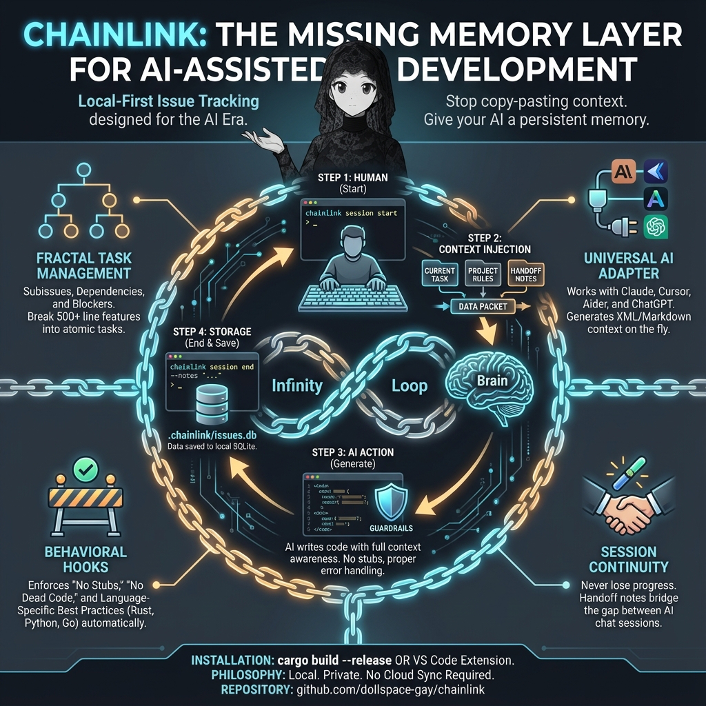

# Chainlink


A simple, lean issue tracker CLI designed for AI-assisted development. Track tasks across sessions with context preservation.



## Features

- **Local-first**: All data stored in SQLite (`.chainlink/issues.db`)
- **Session management**: Preserve context across Claude/AI sessions with handoff notes
- **Subissues**: Break large tasks into smaller, trackable pieces
- **Dependencies**: Track blocking relationships between issues
- **Related issues**: Link related issues together for context
- **Labels & priorities**: Organize issues with labels and priority levels
- **Milestones**: Group issues into milestones/epics for release planning
- **Time tracking**: Start/stop timers to track time spent on issues
- **Smart recommendations**: `chainlink next` suggests what to work on based on priority and progress
- **Tree view**: Visualize issue hierarchy with `chainlink tree`
- **Export/Import**: Backup and restore issues in JSON format
- **Issue archiving**: Archive old closed issues to keep the active list clean
- **Claude Code hooks**: Behavioral guardrails that inject best practices into AI sessions
- **Customizable rules**: Override default rules via `.chainlink/rules/` markdown files
- **No sync complexity**: No git hooks, no auto-push, just simple local storage

## Installation

```bash
# Build from source
cargo build --release

# The binary will be at target/release/chainlink
```

## Quick Start

```bash
# Initialize in any project
chainlink init

# Start a session when you begin work
chainlink session start

# Create issues
chainlink create "Fix login bug" -p high
chainlink create "Add dark mode" -d "Support light/dark theme toggle"

# Set what you're working on
chainlink session work 1

# End session with handoff notes
chainlink session end --notes "Fixed auth bug, dark mode is next"
```

## Commands

### Issue Management

| Command | Description |
|---------|-------------|
| `chainlink create <title>` | Create a new issue |
| `chainlink create <title> -p high` | Create with priority (low/medium/high/critical) |
| `chainlink create <title> -d "desc"` | Create with description |
| `chainlink subissue <parent_id> <title>` | Create a subissue under a parent |
| `chainlink subissue <parent_id> <title> -p high` | Subissue with priority |
| `chainlink list` | List open issues |
| `chainlink list -s all` | List all issues |
| `chainlink list -s closed` | List closed issues |
| `chainlink list -l bug` | Filter by label |
| `chainlink list -p high` | Filter by priority |
| `chainlink show <id>` | Show issue details |
| `chainlink update <id> --title "New"` | Update title |
| `chainlink update <id> -d "desc"` | Update description |
| `chainlink update <id> -p critical` | Update priority |
| `chainlink close <id>` | Close an issue |
| `chainlink reopen <id>` | Reopen a closed issue |
| `chainlink delete <id>` | Delete an issue (with confirmation) |
| `chainlink delete <id> -f` | Delete without confirmation |

### Comments & Labels

| Command | Description |
|---------|-------------|
| `chainlink comment <id> "text"` | Add a comment to an issue |
| `chainlink label <id> <label>` | Add a label to an issue |
| `chainlink unlabel <id> <label>` | Remove a label from an issue |

### Dependencies

| Command | Description |
|---------|-------------|
| `chainlink block <id> <blocker_id>` | Mark issue as blocked by another |
| `chainlink unblock <id> <blocker_id>` | Remove blocking relationship |
| `chainlink blocked` | List all blocked issues |
| `chainlink ready` | List issues ready to work on (no blockers) |

### Related Issues

| Command | Description |
|---------|-------------|
| `chainlink relate <id1> <id2>` | Link two related issues together |
| `chainlink unrelate <id1> <id2>` | Remove relationship between issues |

### Milestones

| Command | Description |
|---------|-------------|
| `chainlink milestone create <name>` | Create a new milestone |
| `chainlink milestone create <name> -d "desc"` | Create with description |
| `chainlink milestone list` | List all milestones |
| `chainlink milestone show <id>` | Show milestone details and progress |
| `chainlink milestone add <milestone_id> <issue_id>` | Add an issue to a milestone |
| `chainlink milestone remove <milestone_id> <issue_id>` | Remove an issue from a milestone |
| `chainlink milestone close <id>` | Close a milestone |
| `chainlink milestone reopen <id>` | Reopen a closed milestone |

### Archiving

| Command | Description |
|---------|-------------|
| `chainlink archive <id>` | Archive a closed issue |
| `chainlink unarchive <id>` | Restore an archived issue |
| `chainlink archived` | List all archived issues |
| `chainlink archive-older <days>` | Archive issues closed more than N days ago |

### Export/Import

| Command | Description |
|---------|-------------|
| `chainlink export` | Export all issues to JSON (stdout) |
| `chainlink export -o backup.json` | Export to a file |
| `chainlink import backup.json` | Import issues from JSON file |
| `chainlink import backup.json --merge` | Merge with existing issues |

### Smart Navigation

| Command | Description |
|---------|-------------|
| `chainlink next` | Recommend the next issue to work on (by priority/progress) |
| `chainlink tree` | Show all issues in a tree hierarchy |
| `chainlink tree -s open` | Show only open issues in tree view |

### Time Tracking

| Command | Description |
|---------|-------------|
| `chainlink start <id>` | Start a timer for an issue |
| `chainlink stop` | Stop the current timer |
| `chainlink timer` | Show current timer status |

### Session Management

Sessions preserve context across AI assistant restarts.

| Command | Description |
|---------|-------------|
| `chainlink session start` | Start a session, shows previous handoff notes |
| `chainlink session work <id>` | Set the issue you're currently working on |
| `chainlink session status` | Show current session info |
| `chainlink session end` | End the current session |
| `chainlink session end --notes "..."` | End with handoff notes for next session |

### Daemon (Optional)

The daemon auto-flushes session state every 30 seconds.

| Command | Description |
|---------|-------------|
| `chainlink daemon start` | Start background daemon |
| `chainlink daemon status` | Check if daemon is running |
| `chainlink daemon stop` | Stop the daemon |

## Workflow Example

```bash
$ chainlink session start
Previous session ended: 2024-01-15 09:00
Handoff notes:
  Working on auth bug. Found issue in token refresh.

Session #5 started.

$ chainlink session work 1
Now working on: #1 Fix login bug

$ chainlink comment 1 "Fixed the token refresh issue"
Added comment to issue #1

$ chainlink close 1
Closed issue #1

$ chainlink ready
Ready issues (no blockers):
  #2    medium   Add dark mode

$ chainlink session end --notes "Closed auth bug. Dark mode is next."
Session #5 ended.
Handoff notes saved.
```

## Storage

All data is stored locally in `.chainlink/issues.db` (SQLite). No external services, no network requests.

## Claude Code Hooks

Chainlink includes behavioral hooks for [Claude Code](https://claude.com/claude-code) that inject best practice reminders into AI sessions. These hooks help ensure Claude follows coding standards without requiring manual prompting.

> **Requirement:** Python 3.6+ must be installed and available in your PATH for hooks to work. The VS Code extension will warn you if Python is not detected.

### What the Hooks Do

The hooks are located in `.claude/hooks/` and configured in `.claude/settings.json`:

| Hook | Trigger | Purpose |
|------|---------|---------|
| `prompt-guard.py` | Every prompt | Injects language-specific best practices, reminds about error handling, security, and no stubs/dead code |
| `post-edit-check.py` | After file edits | Reminds to verify changes compile and follow project patterns |
| `session-start.py` | Session start/resume | Loads chainlink context and previous session handoff notes |

### Behavioral Guardrails

The hooks enforce these principles:

1. **No Stubs**: Implement complete, working code - no placeholder functions or TODO comments
2. **No Dead Code**: Identify incomplete features and complete them, or remove truly dead code
3. **Full Features**: Implement complete features as requested, don't stop partway
4. **Error Handling**: Proper error handling everywhere, no panics on bad input
5. **Security**: Validate input, use parameterized queries, no command injection

### Large Task Management

When code will exceed 500 lines, the hooks guide Claude to:
1. Create a parent issue for the feature
2. Break it into subissues for trackable components
3. Inform the user about the multi-part implementation
4. Work on one subissue at a time

### Language Detection

The hooks auto-detect the project language(s) and inject relevant best practices:
- **Rust**: Use `?` operator, `clippy`, parameterized SQL, avoid `.unwrap()`
- **Python**: Type hints, proper exceptions, `pathlib`, context managers
- **JavaScript/TypeScript**: `const`/`let`, async/await, strict mode, input validation
- **Go**: Check errors, use `context.Context`, `defer` for cleanup
- **Java, C, C++, C#, Ruby, PHP, Swift, Kotlin, Scala, Zig, Odin, Elixir**: Language-specific best practices

### Customizable Rules

Chainlink ships with sensible default rules that can be customized per-project. Rules are stored in `.chainlink/rules/` as markdown files:

| File | Purpose |
|------|---------|
| `global.md` | Behavioral guards (no stubs, error handling, security) |
| `project.md` | Project-specific rules (your custom rules go here) |
| `rust.md`, `python.md`, etc. | Language-specific best practices |

To customize rules:
1. Edit the appropriate file in `.chainlink/rules/`
2. Changes take effect immediately on the next prompt

To reset rules to defaults:
```bash
chainlink init --force
```

### Installing Hooks in Other Projects

Use `chainlink init` in any project to set up hooks and rules:

```bash
cd /your/project
chainlink init
```

Or copy manually:
```bash
cp -r /path/to/chainlink/.claude /your/project/
cp -r /path/to/chainlink/.chainlink/rules /your/project/.chainlink/
```

## Using Chainlink with Any AI Agent

While chainlink includes native hooks for Claude Code, the context provider script allows integration with **any** AI coding assistant.

### The Context Provider

The context provider (`context-provider.py`) generates intelligent context that can be injected into any AI agent's prompts. It:

- Detects project languages and applies relevant coding rules
- Includes current session state and handoff notes
- Lists open/ready issues
- Shows project structure
- Outputs in XML, Markdown, or JSON formats

**Location:** `.chainlink/integrations/context-provider.py`

### Quick Setup (Shell Aliases)

Add these to your `~/.bashrc`, `~/.zshrc`, or PowerShell profile:

**Bash/Zsh:**
```bash
# Generic AI wrapper - prepends chainlink context to any prompt
ai() {
    local ctx=$(python ~/.chainlink/integrations/context-provider.py 2>/dev/null)
    echo -e "$ctx\n\n---\nUser: $*" | your-llm-cli
}

# Aider with chainlink context
aider-cl() {
    python ~/.chainlink/integrations/context-provider.py --format md > /tmp/chainlink-ctx.md
    aider --read /tmp/chainlink-ctx.md "$@"
}

# Copy context to clipboard for pasting into web UIs
chainlink-ctx() {
    python ~/.chainlink/integrations/context-provider.py --clipboard
}
```

**PowerShell:**
```powershell
# Generic AI wrapper
function ai {
    $ctx = python "$env:USERPROFILE\.chainlink\integrations\context-provider.py" 2>$null
    "$ctx`n`n---`nUser: $($args -join ' ')" | your-llm-cli
}

# Copy context to clipboard
function chainlink-ctx {
    python "$env:USERPROFILE\.chainlink\integrations\context-provider.py" | Set-Clipboard
}
```

### Context Provider Usage

```bash
# Full context (session + issues + rules + structure)
python context-provider.py

# Specific sections only
python context-provider.py --session      # Session state only
python context-provider.py --issues       # Issues only
python context-provider.py --rules        # Coding rules only
python context-provider.py --structure    # Project tree only

# Output formats
python context-provider.py --format xml   # XML tags (default, best for LLMs)
python context-provider.py --format md    # Markdown (human readable)
python context-provider.py --format json  # JSON (programmatic access)

# Integration helpers
python context-provider.py --prepend "fix the auth bug"  # Wrap a prompt
python context-provider.py --clipboard                    # Copy to clipboard
python context-provider.py --env                          # Output as env vars
```

### Agent-Specific Integration

**Cursor:**
```bash
# Generate .cursorrules with chainlink context (run once per session)
python context-provider.py --format md --rules > .cursorrules
```

**Aider:**
```bash
# Method 1: Read file
python context-provider.py --format md > context.md
aider --read context.md

# Method 2: Wrapper script (see aliases above)
aider-cl --model gpt-4
```

**Continue.dev (VS Code):**
Add to `.continue/config.json`:
```json
{
  "contextProviders": [
    {
      "name": "exec",
      "params": {
        "command": "python .chainlink/integrations/context-provider.py --format md"
      }
    }
  ]
}
```

**OpenAI API / Anthropic API direct calls:**
```bash
# Prepend context to your prompt
CONTEXT=$(python context-provider.py)
curl https://api.openai.com/v1/chat/completions \
  -H "Authorization: Bearer $OPENAI_API_KEY" \
  -d "{
    \"model\": \"gpt-4\",
    \"messages\": [{\"role\": \"system\", \"content\": \"$CONTEXT\"},
                   {\"role\": \"user\", \"content\": \"$PROMPT\"}]
  }"
```

**Web UIs (ChatGPT, Claude.ai, etc.):**
```bash
# Copy to clipboard, then paste as first message
python context-provider.py --clipboard
```

### What Gets Injected

The context provider outputs:

```xml
<chainlink-session>
Session #5 active
Working on: #12 Fix authentication bug
Handoff notes: Found issue in token refresh logic
</chainlink-session>

<chainlink-issues>
Ready issues (unblocked):
  #12   high     Fix authentication bug
  #15   medium   Add dark mode toggle
Open issues:
  #18   low      Update documentation
</chainlink-issues>

<coding-rules>
### General Requirements
1. **NO STUBS**: Never write placeholder comments, empty bodies...
2. **ERROR HANDLING**: Proper error handling everywhere...

### Rust Best Practices
- Use `?` operator over `.unwrap()`
- Use `anyhow::Result` for application errors
...
</coding-rules>

<workflow-reminder>
- Use `chainlink session start` at the beginning of work
- Use `chainlink session work <id>` to mark current focus
- Add comments: `chainlink comment <id> "..."`
- End with notes: `chainlink session end --notes "..."`
</workflow-reminder>
```

### Per-Turn vs Static Context

| Approach | Freshness | Setup |
|----------|-----------|-------|
| Shell alias wrapper | Per-turn (fresh every time) | Add alias to shell config |
| `.cursorrules` | Static (regenerate manually) | Run script, paste output |
| Claude Code hooks | Per-turn (automatic) | Built-in, no setup needed |

For the best experience with non-Claude agents, use the shell alias approach to get fresh context on every prompt.

## VS Code Extension

Chainlink is also available as a VS Code extension that bundles the CLI binary:

**Install:** Search "Chainlink Issue Tracker" in VS Code Extensions, or visit the [VS Code Marketplace](https://marketplace.visualstudio.com/items?itemName=Dollspace-gay.chainlink-issue-tracker).

**Features:**
- Commands accessible from Command Palette (Ctrl+Shift+P)
- Status bar indicator for daemon status
- Auto-starts daemon when `.chainlink` project detected
- Works on Windows, Linux, and macOS

## Development

```bash
# Run tests
cargo test

# Run with clippy
cargo clippy -- -D warnings

# Format code
cargo fmt
```

## License

MIT
